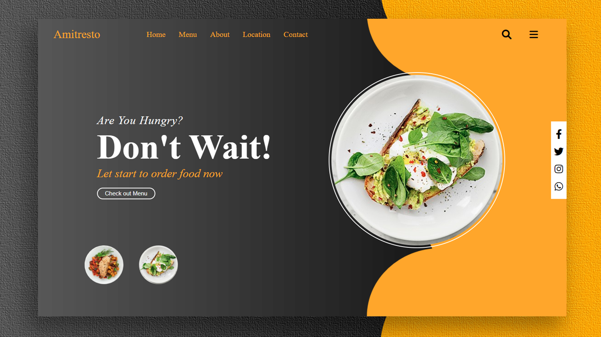

# 🍜 Tadasum - Restaurant Website

Website restoran sederhana menggunakan **HTML**, **CSS**, dan **JavaScript**.  
Menampilkan tampilan menarik, navigasi antar halaman, dan fitur ganti gambar otomatis.

🔗 **Live Demo**: [tadasum-fawn.vercel.app](https://tadasum-fawn.vercel.app)

---

## 🚀 Fitur

- ✅ Desain responsif dengan HTML & CSS
- ✅ Navigasi antar halaman:
  - Beranda (`index.html`)
  - Game interaktif (`games.html`)
  - Halaman Pembelian (`pembelian.html`)
  - Halaman Pesanan (`pesanan.html`)
- ✅ Fitur interaktif JavaScript (ubah gambar otomatis)
- ✅ Struktur folder rapi (CSS, JS, dan image terpisah)

---

## 🛠️ Teknologi

- [x] HTML5
- [x] CSS3
- [x] JavaScript (DOM manipulation)
- [x] Vercel (untuk hosting)

---

## 📁 Struktur File

```
📦 tadasum
 ┣ 📂 css/             → File CSS untuk styling
 ┣ 📂 js/              → JavaScript untuk interaksi
 ┣ 📂 image/           → Gambar-gambar website
 ┣ 📄 index.html       → Halaman utama
 ┣ 📄 games.html       → Halaman game
 ┣ 📄 pembelian.html   → Halaman pembelian
 ┣ 📄 pesanan.html     → Halaman pesanan
 ┣ 📄 Slide6.PNG       → Preview tampilan
 ┗ 📄 README.md
```

---

## 📷 Preview



---

## 📹 Video Tutorial

> 🎥 Video lengkap tersedia di YouTube. (Tambahkan link jika sudah tersedia)

---

## 👨‍💻 Developer

- GitHub: [hosigakitama](https://github.com/hosigakitama)
- Proyek ini dibuat untuk pembelajaran dasar frontend website statis dengan HTML, CSS, dan JavaScript.

---
